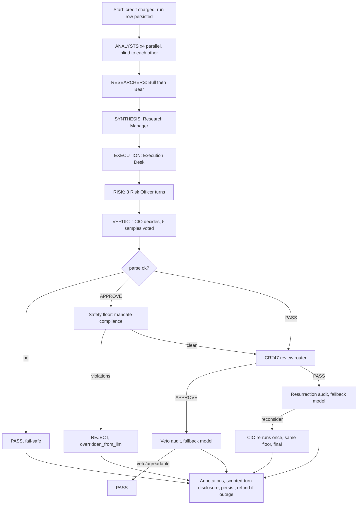

# How a Room convenes and reaches its final recommendation

Current-state walkthrough, verified against code on 2026-10-06 (`backend/app/services/room_runner.py`, `agents/safety_floor.py`, `core/config.py`, `docker-compose.yml`). Agent names use CR160 titles; `agent_id` values in code are frozen and differ.

Supersedes for process purposes: [`convene_the_room.md`](../../initial_specs/02_agents/convene_the_room.md) (stale — see §7).

---

## 1. Summary

1. A convene runs **six phases in fixed order**; only the first is parallel.
2. Every phase before VERDICT produces *opinion text*. Only the CIO produces the *decision*.
3. The decision then passes a **deterministic safety floor** (no LLM), then an optional **second-pass audit** on a different model.
4. The final output is a `Verdict`: `APPROVE`, `PASS`, `REJECT` or `NO_VERDICT`.

## 2. Before the first phase

1. **Trigger and charge.** `start_run` (`api/room.py`) charges credits (`insufficient_credits` returned otherwise); the charge, incl. any live-feed surcharge, is stored on the row (`credit_cost`) so refunds return the exact amount.
2. **Roster filter (CR098).** Tenure pull-back can **withhold** analysts. Withheld analysts never run; an `agent_withheld` event is emitted per analyst. Withheld Market (Technical Strategist) ⇒ CIO step skips the LLM and issues `NO_VERDICT` (`_assemble_no_verdict`).
3. **Run row persisted**, `started` event emitted (so a client that sleeps can reattach by `run_id`), then `live_data_notice` — emitted by the runner, not the model (CR090).
4. **Context built once**: mandate, portfolio value/drawdown, sector holdings, trade-history (cooldown / trade-count / open-risk), halal + classification + locale universes, 8-K forensic flag. All later steps read this same context.
5. **Live vs scripted.** `live = gateway.has_real_provider()`. Scripted (demo) path uses canned turns, `_assemble_verdict`, and never runs the audit.

## 3. Phase order (`PHASES`, `room_runner.py:209`)

| # | Phase | Who | Mode | Notes |
|---|---|---|---|---|
| 1 | ANALYSTS | Fundamentals Analyst, Technical Strategist, Macro & Events, Flow & Positioning | **Parallel** (`asyncio.gather`) | Share one data block, see an empty transcript, blind to each other. Output streamed in fixed order regardless of completion order. Guard: `test_cr077_phase_parallelism` pins ANALYSTS as the only parallel phase. |
| 2 | RESEARCHERS | Bull Researcher, Bear Researcher | Sequential | Order Bull→Bear by default. `ROOM_DEBATE_ORDER_SEEDED` (default **false**) seeds it per run (CR219 R58). Order served is logged either way. |
| 3 | SYNTHESIS | Research Manager | Sequential | Reads analysts + debate. |
| 4 | EXECUTION | Execution Desk | Sequential | Proposes size / entry / stop / target — stored in ctx for the Risk phase. |
| 5 | RISK | Risk Officer — Aggressive, Conservative, Balanced | Sequential | See §3.1. |
| 6 | VERDICT | Chief Investment Officer | Single step | See §4. |

Each later phase reads the full transcript so far; that is what makes phases 2–5 a debate and why they must not be parallelised (DEF084 shape).

### 3.1 RISK phase — two paths

1. **Default (live Alpha today):** three sequential LLM turns, one per risk voice. `ROOM_RISK_OFFICER_ENABLED` defaults **false** in `config.py:834` and `docker-compose.yml:424`.
2. **CR201 path (flag on):** one structured Risk Officer call (`_run_risk_officer`) returns JSON sized options over a computed ladder; the three voices are *rendered* from that payload with no further LLM calls. Unparseable / timeout / error ⇒ turns render the deterministic ladder alone, each marked `[AMI …]` in the transcript (CR040). Not to be enabled in the same window as `PM_OPTION_LADDER_ENABLED` (confounds attribution).

## 4. VERDICT phase — `_run_cio_step` (`room_runner.py:4922`)

One function serves the main run and the "Ask the CIO again" retry (CR237), so the floor, compliance check, sizing and annotations exist once.

1. **Decision draws.** CIO reads the full 11-turn transcript. `PM_SELF_CONSISTENCY_SAMPLES` defaults to **5** independent draws (CR197/CR214); lost draws are replaced (DEF397). `_vote_pm_samples` picks the winner; the APPROVE bar scales with the mandate's `risk_score` (CR228). The verdict records `samples` and `approve_votes`; a split vote is disclosed in the reason text.
2. **Parse.** `_parse_pm_verdict`. Unparseable ⇒ one reformat retry that may only *recover an APPROVE* (DEF058/DEF067); otherwise fail-safe `PASS`.
3. **LLM unreachable** ⇒ outage `PASS` (DEF059) — never a confident buy.
4. **APPROVE ⇒ safety floor** (`_floor_pm_approve` → `enforce_safety_floor` → `check_mandate_compliance`, `agents/safety_floor.py`). Deterministic, no LLM, **uncoachable**. A violation overrides to **`REJECT`** with `overridden_from_llm=True`. Rules checked, in order:
   1. ticker allowlist / blocklist
   2. long-only (no selling shares not held)
   3. halal (sourced AAOIFI allowlist), no-fossil / no-tobacco-alcohol-gambling / ESG-lite, liquid-only
   4. locale-available instruments
   5. single-name position-size cap; sector-concentration cap
   6. post-loss cooldown, max open positions, over-trading brake, total open-risk cap
   7. drawdown projection
   8. 8-K Item 4.02 non-reliance block on BUY (CR247 1D, flag-gated)
   An R:R-vs-levels coherence pass only *corrects narration text*; it never vetoes.
5. **PASS** needs no compliance check.

## 5. Post-decision review (CR247 Phase 4)

Code routes, LLMs judge (`_verdict_review_route`). Fires only when: live convene, a real CIO turn exists (not an outage/fail-safe PASS), and the matching flag is on. Both flags default **true** (`docker-compose.yml:519-520`).

1. **APPROVE ⇒ veto audit.** Reads Bear + Conservative outputs. Needs both to be *real* (scripted dissent ⇒ skipped, recorded). `veto` or an **unreadable** reply ⇒ `_veto_flip` APPROVE→**PASS** (never REJECT; levels cleared; original kept in journal record).
2. **PASS ⇒ resurrection audit.** `reconsider` ⇒ `_resurrection_rerun`: CIO re-draws **once** (single draw, not 5) with the audit note, meets the **same** floor, and is **final** — no second review, no loop. Unreadable audit ⇒ verdict stands (fail closed). Narration gets " (Reconsidered once at the audit's request.)".
3. Audits run on the gateway's **fallback provider** (a different model than the CIO; mid tier, 700-token budget). No fallback registered ⇒ loud log, verdict unchanged.
4. A review error never breaks the convene; it lands on the unchanged verdict with a `VerdictReviewRecord`.

## 6. Finalisation

Applied to *every* path (APPROVE / PASS / REJECT / NO_VERDICT), in `_run_cio_step` then `run()`:

1. `opinions_not_included` = withheld analysts (CR098).
2. **Scripted-turn disclosure (CR219 R51)** — live only. Some canned turns ⇒ appended to reason; `scripted_turns >= ROOM_MAX_SCRIPTED_TURNS` ⇒ decision **discarded**, `NO_VERDICT` ("room incomplete").
3. Direction-vs-price coherence annotation (DEF231).
4. `run.verdict` set; status `COMPLETED`; next-convene basis stamped (CR219 R60); run persisted.
5. **Outage-shaped verdict** (DEF059 PASS or R51 NO_VERDICT) ⇒ credits **refunded** (best-effort), "This Room wasn't charged." appended only if the refund succeeded (DEF432). A deliberate Market-withheld `NO_VERDICT` is *not* an outage and is charged.
6. A cancelled run is never refunded; a failed run is refunded unconditionally (CR039).

## 7. Differences vs `convene_the_room.md`

1. Says Bull and Bear run in parallel — **code is sequential**.
2. Uses pre-CR160 names (PM, Trader, Debators) — now CIO, Execution Desk, Risk Officer voices.
3. Order: it places the compliance check as a PM-side step; code runs it as a deterministic step *inside* the CIO phase, **after** RISK.
4. No mention of: 5-sample vote (CR197/214), CR201 Risk Officer path, CR247 veto/resurrection, CR098 withheld analysts, CR219 R51 scripted-turn discard, DEF432 outage refund.

## 8. Open points

1. `convene_the_room.md` should be refreshed from this doc (docs-only; Saiful to approve scope).
2. Flag defaults above are the compose defaults; melehost's `.env` may override — confirm there before quoting them as live.
